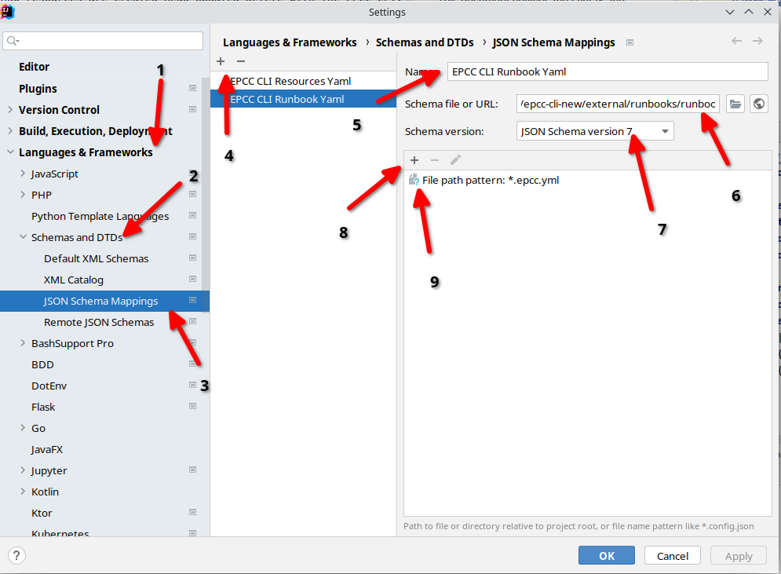

# Runbook Development

## Introduction

This document outlines the syntax and capabilities of runbooks. 

## Prerequisites

Users developing runbooks should have familiarity with:
1. How resources are Created-Read-Updated-Delete with the EPCC CLI.
2. How aliases work in the EPCC CLI.
3. Familiarity with [Go Templates](https://blog.gopheracademy.com/advent-2017/using-go-templates/) may help for more advanced cases.
  * The EPCC CLI uses the [Sprig](http://masterminds.github.io/sprig/) template functions which is the same library used by [Helm templates](https://helm.sh/docs/chart_template_guide/getting_started/)   

### Tip

#### JSON Schema
There is a JSON Schema for Runbooks available [here](https://github.com/elasticpath/epcc-cli/blob/main/external/runbooks/runbook_schema.json), if you are using IntelliJ or GoLand you can use IntelliJ's [built-in support for JSON Templates](https://www.jetbrains.com/help/idea/json.html#8991cb99).



#### Qualified Aliases

You might find runbooks more readable if you prefix an aliases with the JSON API Type (this is the type reported by the API) (i.e., an alias like last_read=entity could be `user_authentication_info/last_read=entity`)

## Syntax

Each runbook consists of a **Yaml** document that defines a set of actions that can be run:

### A Simple Example

```yaml
# The name of the runbook is used in command lines for the 4th argument (e.g., epcc runbooks run hello-world) 
name: hello-world
description:
  short: "A hello world runbook"
actions:
  # The action name is used in command lines for the 4th argument (e.g., epcc runbook run hello-world create-customer)
  create-customer:
   commands:
   # Commands use a shell like syntax with word splitting
   - epcc create customer name "Hello World" email "hello@world.example"
   - epcc update customer name=Hello_World name "Goodbye"
  reset:
   commands:
   - epcc delete customer email=hello@world.example
```

A few interesting points to note about the above example:
1. The runbook defines two actions **create-customer** and **reset**.
2. Each element in the list is run in sequence, one at a time.
3. Aliases are used to reference previously existing arguments.
4. Conventionally a lot of runbooks use the action **reset**, to reset the store to the initial state. 
5. Each line can be one of `epcc create`, `epcc get`, `epcc update`, `epcc delete`.
   * There is also `sleep <N>` which can be used to delay execution for a bite, this is a coarse mechanism to handle asynchronous processes.

### Parallel Operations

Runbooks can also process things in parallel, this is done by using multiple commands in a single list element (or line). The syntax here is **subtle**, and relies on Yaml HereDoc syntax where newlines are preserved.

```yaml
name: hello-world
description:
  short: "A hello world runbook"
actions:
  create-10-customers:
   commands:
   - |
    epcc create customer name "Stephen Sloan" email "Stephen.Sloan@test.example"
    epcc create customer name "Antwan Griffin" email "Antwan.Griffin@test.example"
    epcc create customer name "Yurem Thornton" email "Yurem.Thornton@test.example"
    epcc create customer name "Lydia Rice" email "Lydia.Rice@test.example"
    epcc create customer name "Jenny Lopez" email "Jenny.Lopez@test.example"
    epcc create customer name "Javier Green" email "Javier.Green@test.example"
    epcc create customer name "Lennon Mills" email "Lennon.Mills@test.example"
    epcc create customer name "Kelly Burns" email "Kelly.Burns@test.example"
    epcc create customer name "Mohamed Love" email "Mohamed.Love@test.example"
    epcc create customer name "Lindsey Sexton" email "Lindsey.Sexton@test.example"
```

Some important observations are:
1. All requests to EPCC will be subject to the rate limit passed in via `--rate-limit`, so you don't need to worry about lots of parallel requests in flight.
2. Each **command** (i.e., line starting with a -) is processed at a time, if you are creating lots of things in parallel it might help to split them in multiple commands anyway (though this won't be an issue unless you are using templates).

### Variables & Templates

Runbooks support variables and [Go Templates](https://blog.gopheracademy.com/advent-2017/using-go-templates/) with [Sprig](http://masterminds.github.io/sprig/) template functions. These can be used to create more dynamic runbooks.

```yaml
name: hello-world
description:
  short: "A hello world runbook"
actions:
  create-some-customer-addresses:
   variables:
    customer_id:
      type: RESOURCE_ID:customer
      default: 00000000-feed-dada-iced-c0ffee000000
      # When you set a variable as required with a default, the default is used only for the `show` command.
      required: true
      description:
       short: "Customer with which to create the address"
    country:
      type: STRING
      default: "US"
      description:
       short: "The country the address should be in"
    number_of_addresses:
      type: INT
      default: 10
      description:
       short: "The number of addresses"
   description:
    short: "Create some addresses"
   commands:
    - |
      {{- range untilStep 0 .number_of_addresses 1 }}
      epcc create customer-address  "{{$.customer_id}}" name "address_{{.}}" first_name "John" last_name "Smith" line_1 "1234 Main Street" county "XX" "postcode" "H0H 0H0" country "{{$.country}}"
      {{- end -}}
```

The user can then supply the variables on the command line, each type can be one of:

1. INT - An integer
2. STRING - A string
3. RESOURCE_ID:<type> - A resource type (retrieved from `epcc resource-list`). This is preferable for auto complete purposes.

When users type the command, they will see the supplied variables:

```text
#epcc runbooks show hello-world create-some-customer-addresses --help
Create some addresses

Usage:
  epcc runbooks show hello-world create-some-customer-addresses [flags]

Flags:
    --country string              The country the address should be in (default "US")
    --customer_id string          Customer with which to create the address 
  -h, --help                      help for create-some-customer-addresses
    --number_of_addresses string  The number of addresses (default "10")
```
##### Dashed Argument Names

If you would like to use a dashed argument name you need to use a different syntax in the chart:

```
{{ . index "dashed-argument-name" }}
```

#### Showing the output

You can use the show command to see what a rendered script looks like (although you will lose any information about concurrency):

```text
#epcc runbooks show hello-world create-some-customer-addresses --number_of_addresses 2 --customer_id "Hello World" --country DE
epcc create customer-address  "Hello World" name "address_0" first_name "John" last_name "Smith" line_1 "1234 Main Street" county "XX" "postcode" "H0H 0H0" country "DE"
epcc create customer-address  "Hello World" name "address_1" first_name "John" last_name "Smith" line_1 "1234 Main Street" county "XX" "postcode" "H0H 0H0" country "DE"
```

### Error Handling

By default, an error in a command will stop execution, when operating concurrently all commands will finish in that block, and then abort. In some cases, it may be the case that errors are unavoidable, in which case the **ignore_errors** block can be used. In the future more granular error handling could be implemented based on need.

```yaml
name: hello-world
description:
  short: "A hello world runbook"
actions:
  reset:
   ignore_errors: true
   commands:
    - epcc delete customer email=hello@world.example
    - |
      epcc delete customer email=stephen.sloan@test.example
      epcc delete customer email=antwan.griffin@test.example
      epcc delete customer email=yurem.thornton@test.example
      epcc delete customer email=lydia.rice@test.example
      epcc delete customer email=jenny.lopez@test.example
      epcc delete customer email=javier.green@test.example
      epcc delete customer email=lennon.mills@test.example
      epcc delete customer email=kelly.burns@test.example
      epcc delete customer email=mohamed.love@test.example
      epcc delete customer email=lindsey.sexton@test.example
```


